# films_lab_project

Учебный проект: связка Python + PostgreSQL + Tkinter.

## Описание
Проект демонстрирует работу с базой данных PostgreSQL из Python. Включает в себя:
- Выполнение SQL-запросов (SELECT) с различными условиями.
- Добавление данных в базу через консольный ввод (INSERT).
- Создание графического интерфейса (GUI) для добавления фильмов на Tkinter.
- Авторизацию пользователя с разделением прав и записью в отдельную базу данных.

## Структура проекта
- `queries.sql` — все SQL-запросы (Блок 2)
- `app.py` — SELECT * FROM films
- `app2.py` — SELECT двух столбцов
- `app3.py` — SELECT трёх столбцов
- `app4.py` — SELECT с WHERE
- `app5.py` — SELECT двух столбцов с WHERE
- `app6.py` — INSERT через input()
- `app_tk.py` — GUI на Tkinter для добавления фильма
- `app_auth.py` — окно авторизации и регистрации + форма добавления фильма

## Базы данных
- `films_lab` — база с фильмами (таблица `films`)
- `user_ui_db` — база с пользователями (таблица `users`)

## Скриншоты работы

### Запросы (Query Tool)
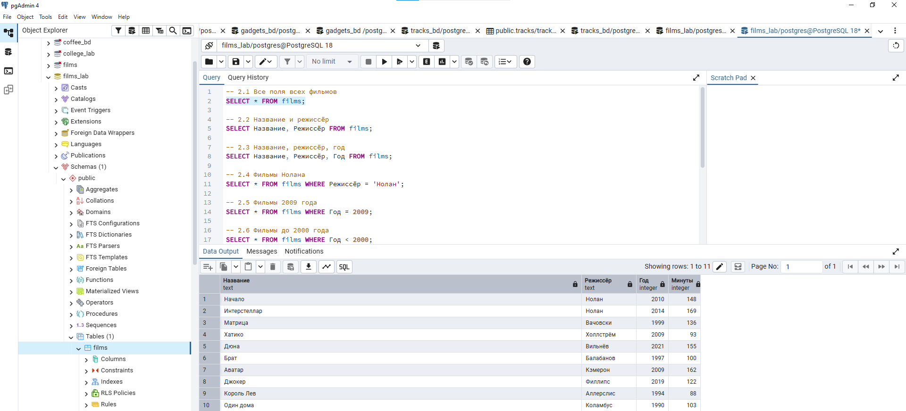
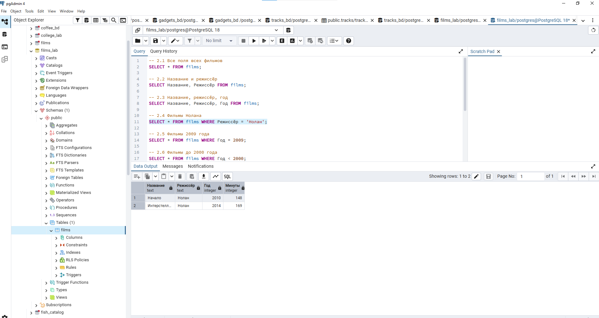
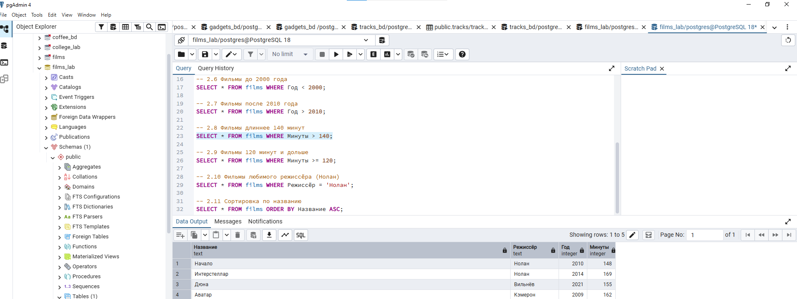
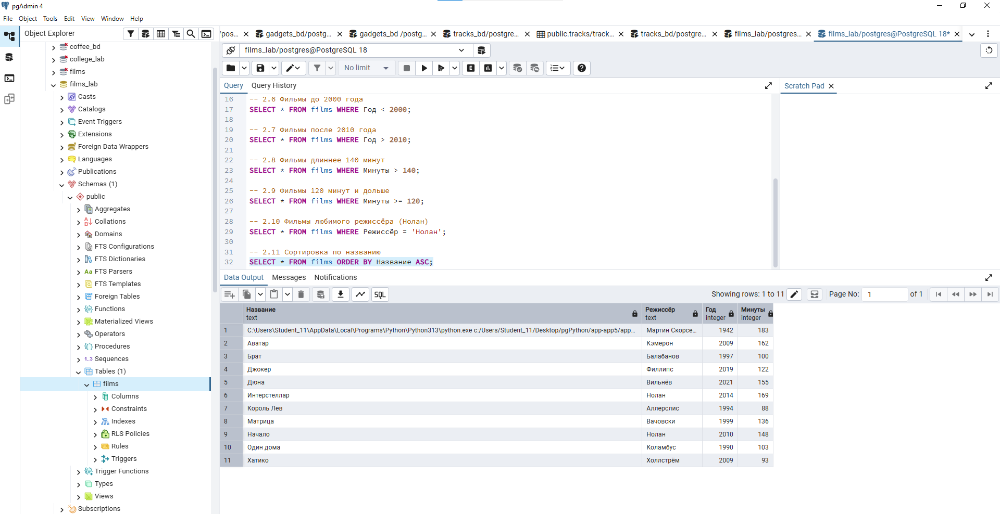

### Работа Python-скриптов
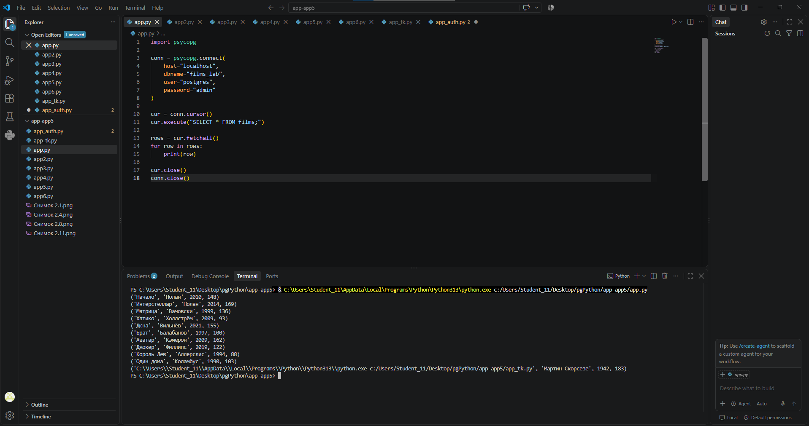

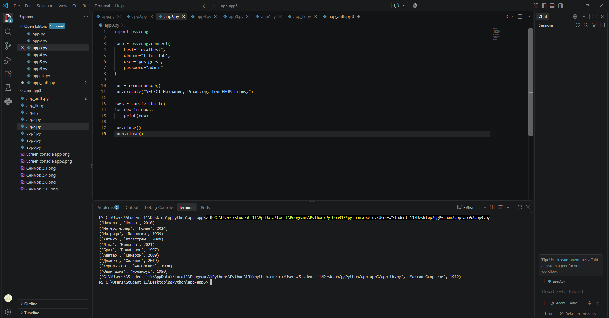
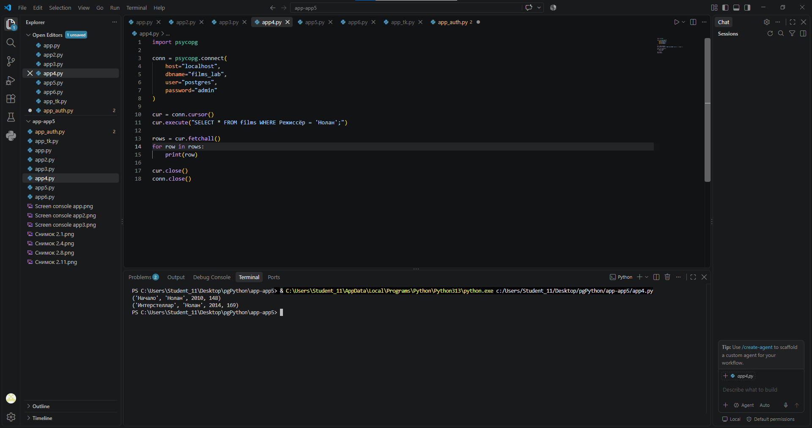
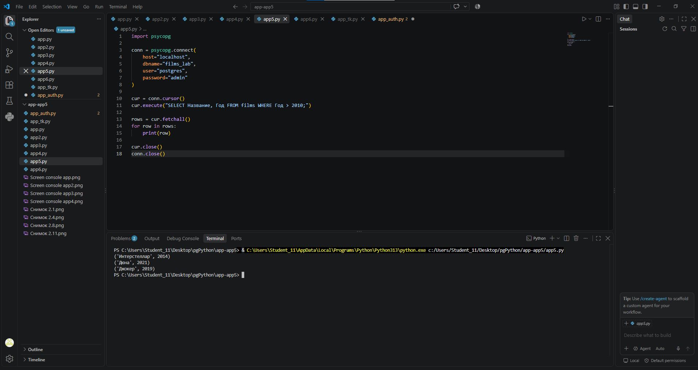
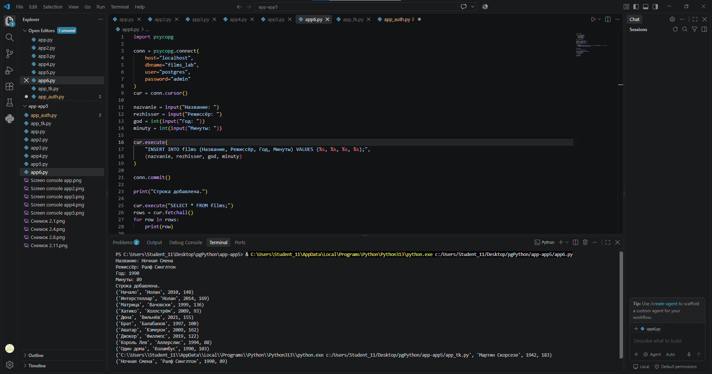

### Графический интерфейс (Tkinter)
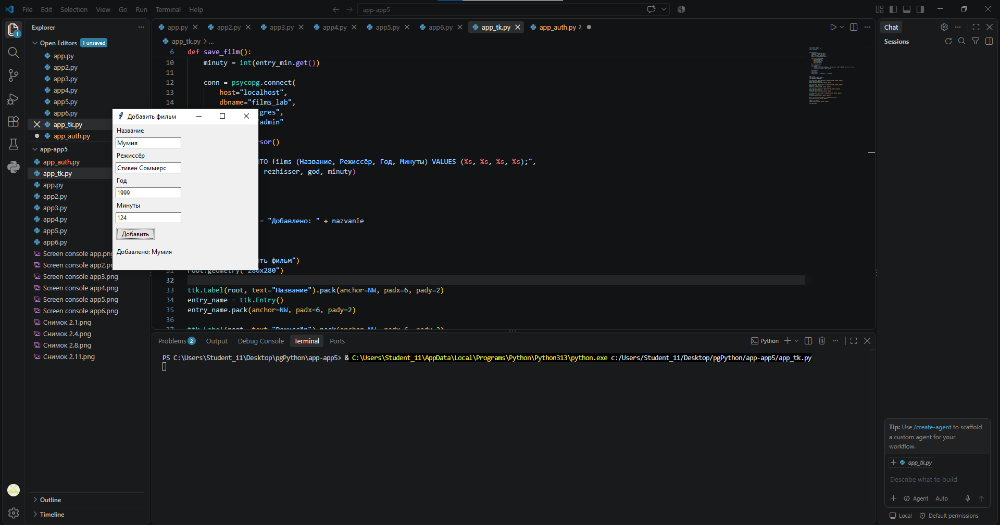

### Авторизация
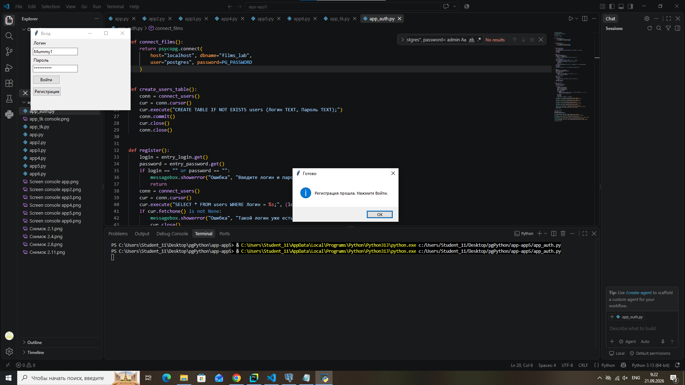

## Как запустить
1. Установить библиотеку для работы с PostgreSQL:
   ```bash
   pip install psycopg[binary]